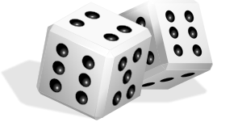

Assessment Recap : Functions, Parameters and passing data.

----------

In this task you will have to fix a piece of sample code, describe it's purpose and improve it.
Your progress will be judged using these criteria:

Grade E & F
- You will be able to describe the purpose of this code.
- You will be able to fix some syntax errors (with some support)
- The program may partially run and be partially commented

Grade D & C
- You will be able to describe the purpose of this code.
- You will be able to fix all the syntax & runtime errors.
- Your code will run, the program will behave as expected and will be commented

Grade B,A & A*
- You will be able to describe the purpose of this code and describe practical uses for it
- You will be able to fix all the syntax & runtime errors and improve the efficiency of the code.
- Your code will run and you will have extended the function of the code and provide clear annotation of your code.

The code can be seen below and opened [here](diceRoller.py).
    
#Coin flip program
#Describe the purpose of this program here.

inport random;time

s1 = "- - - - -\n|       |\n|   O   |\n|       |\n- - - - -\n"
s2 = "- - - - -\n| O     |\n|       |\n|     O |\n- - - - -\n"
s3 = "- - - - -\n| O     |\n|   O   |\n|     O |\n- - - - -\n"
s4 = "- - - - -\n| O   O |\n|       |\n| O   O |\n- - - - -\n"
s5 = "- - - - -\n| O   O |\n|   O   |\n| O   O |\n- - - - -\n"
s6 = "- - - - -\n| O   O |\n| O   O |\n| O   O |\n- - - - -\n"

def roll():
    Print("rolling....."
    roll = rand.randing(7)

def show_dice()
    if roll = 1:
        print(S1)
    else roll = 2
        print(s2)
    else roll = 3
        print(s3)
    else roll = 4
        print(s4)
    else roll = 5
        print(s5)
    else roll = 6
        print(s6)

while True:
    input("Press Enter to roll")
    roll
    time.sleep(1)
    show_dice(roll)

Tasks:
1. Fork this repository and open in your account.
2. Copy the code into Python and try to run.
3. Fix the errors in the code (there are at least 20)
4. For some errors you might need help, try this [code academy exercise](http://www.codecademy.com/courses/4fd5102e43dcd00003032127/resume?curriculum_id=4f89dab3d788890003000096) (just the first 4 tasks)
4. Describe some errors you found using the comment space at the bottom.
5. Can you make the program ask for user input before rolling
6. Can you make it roll until a 6 is rolled?
7. How about until the player rolls any number twice in a row. 

